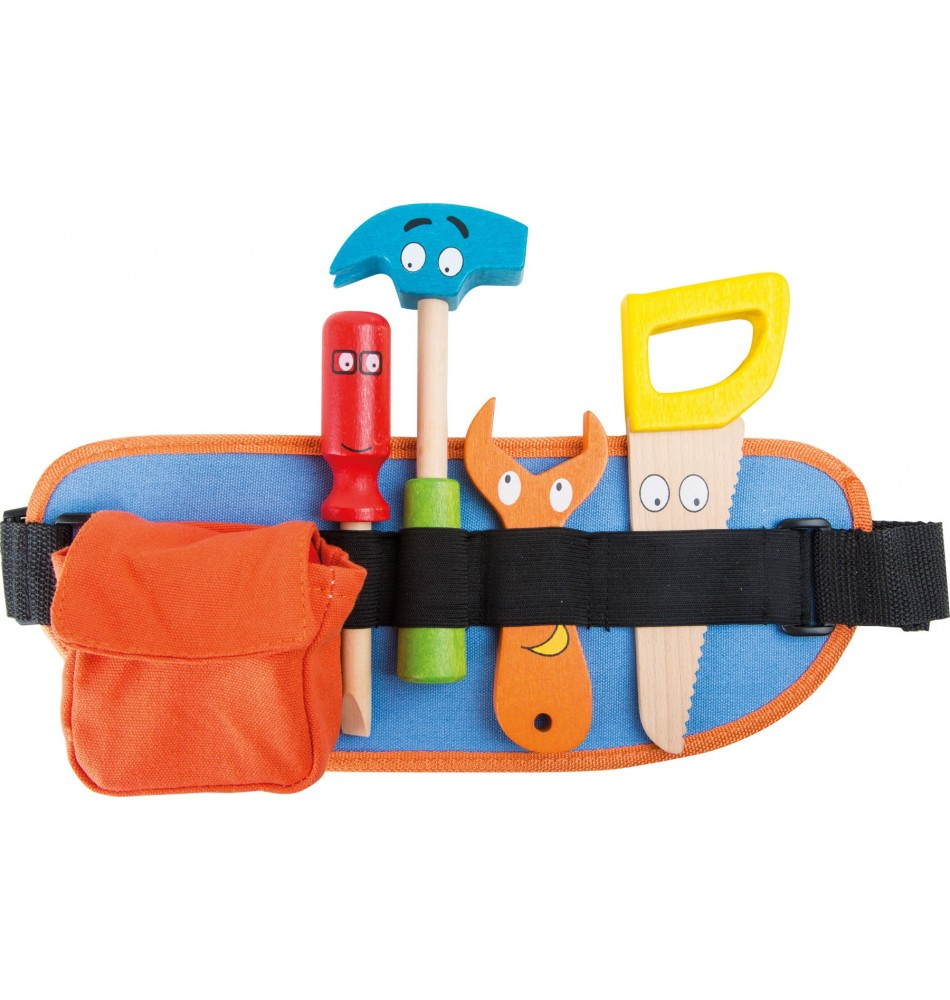
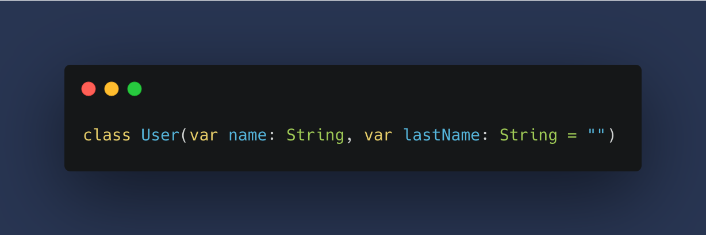
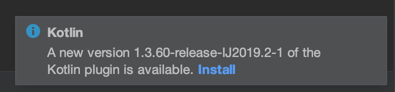

footer: @jlengrand
slidenumbers: true

# Introducing Kotlin in your organization
## The easy way
---

## s/Kotlin/*/g

---

# 👋👋

 

- Julien Lengrand-Lambert
- Developer Advocate **@Adyen**
- Kotlin GDE 
- **@jlengrand**

 

- #Meetups #Kotlin #Gardening 

---

# 👋👋

 

- Hielke de Vries
- Currently Scala Developer
- Former pentester
- When not full-FP -> Kotlin

 

---

## This talk

* A look at Kotlin today
* Tips on how to convince colleagues and **management**

---

## How it started

* Team Lead at ING
* No greenfield, existing applications
* Still 'stuck' on Java 8 due to local tooling
* Need to keep learning, experiment, and grow as a team

<!-- Not really actually for productivity, more local interest -->
<!-- -> ING journey, learnings, blog -->

<!-- https://medium.com/ing-blog/introducing-kotlin-at-ing-a-long-but-rewarding-story-1bfcd3dc8da0 -->

---

---

## Convincing at many levels

* Security
* Compliancy
* Management
* Colleagues...

* First team (on the backend)

---

# A step back : Kotlin today

---

## How old is Kotlin?

* Kotlin : 10 years old (July 2011)
* Java : 26 years 
* Go : 12 years old
* Rust : 11 years

---

## Some numbers

* **\> 4.8 Million** users last year
* 4th most loved programming language 
* **2nd most popular language on the JVM** 
* Taught in 45 of the top 200 universities

<!-- https://www.jetbrains.com/lp/devecosystem-2021/kotlin/ -->
<!-- https://snyk.io/jvm-ecosystem-report-2021/ -->

---

## Kotlin is here to stay

* 2019 : Google chooses Kotlin first for Android
* 2020 : Creation of the Kotlin Foundation
* 2021 : AWS announces idiomatic Kotlin SDK
* 2021 : Kotlin multiplatform comes out of Beta

<!-- https://en.wikipedia.org/wiki/Kotlin_(programming_language) -->

---

# A few compelling use cases

<!-- https://www.kotlinvsjava.com/classes.html -->

---

## Ceremony 

---

<!-- Optional arguments -->

<!-- final class User {
     private String name;
     private String lastName;

     public User(String name) {
         this(name, "");
     }

     public User(String name, String lastName) {
         this.name = name;
         this.lastName = lastName;
     }

     // And Getters & Setters
 }-->

<!-- class User(var name: String, var lastName: String = "")-->

---

## Concurrency

---

<!-- https://openvalue.blog/posts/2020/11/20/concurrency-in-kotlin/ -->

---

## Functional programming

---

<!--     public List<String> processStrings(List<String> strings){
        return strings.stream()
                .filter(s-> s.equals("Hello") || s.equals("World") )
                .map(s -> s + " processed")
                .collect(Collectors.toList());
    }-->

<!--    
fun processStrings(strings: List<String>): List<String> = strings
    .filter { it == "Hello" || it == "World" }
    .map { "$it processed" }
    }-->

---

## When expressions

---

<!-- https://medium.com/@kamilbekar/how-to-use-sealed-class-in-kotlin-f186c30a21e2 -->

---

# Let's do it!

## The first 80%

---

---

---

---

---

# Now the real work begins

## The last 80% 

---

## We have much convincing to do

* Convincing colleagues
* Convincing security / compliance
* Convincing management

---

## Convincing colleagues

---

## Invest in your own knowledge

* Be the Subject expert in the company (as a team)
* Help solve other people's questions
* Don't minimize potential issues (I don't know) 

---

## Get others onboard! 

* Objectively better in many cases - easy sell?
* Many colleagues are fine with Java
* Find a way to bring Kotlin under attention

---

## Get others onboard! 

* Advent of Code - invite all engineers
* Why don't you try a new language?
* Promote Kotlin during AoC
* Workfloor chat about AoC puzzles

---

## Convincing Security / Compliance

---

## Convincing Security / Compliance

* All about being safe, not losing money
* Scary - new programming language
* Convincing Scala took ages

---

## Convincing Security / Compliance

* Does it run in Fortify? No
* Is it supported by any of our tools? No
* How do you expect us to support it?

---

## Convincing Security / Compliance

* Prove that Kotlin is safe
* Using less well-known tools; FindSecBugs
* Bring out the AoC contenders
* Facts
* Lobby
* Be helpful, give solutions

---

## Convincing management

---

## The small experiment

* Make it contained
* Make it risk free
* Make it reversible
* Make it cheap

Our team, one application, No overhead

---

## Report! 

* Communicate about progress
* Verbalize next steps
* Improve in public

---

## Use numbers

* Show success 
* But make it real and relevant
* Internal numbers count!

**-> Adapt your language and objectives!**
**-> There is no wrong question!**

---

## Find your heroes inside 

* Who is a big fan of the language?
* Who can benefit from it?
* Who is excited about trying new things?

---

## Bring heroes from outside

* Make your choice a reality
* Make it visible !  

---

## Find authority

* Certification
* Course
* Titles, ....

---

## Create your own reality

---

<!-- https://www.ximedes.com/2018-03-25/kotlin-a-new-tool-in-the-box/ -->
---

## And don't forget! Don't be a Zealot <3

---

## There will be another fight tomorrow

---

# Some fun questions I've had

---

## If we allow Kotlin today, why not Haskell tomorrow?

---

## How can we hire people that know Kotlin? Won’t it be hard to find them on the market?

---

## Can't Kotlin die tomorrow, look what happened to ...?

---

## So Kotlin, is it like replacing AngularJs?

---

## Why don't you just use Scala? We already have processes in place?

---

# Thank you!

---

## Big thanks to Hielke de Vries for the help

---

# Sources : 

* https://github.com/jlengrand/introducing-kotlin-in-your-org
* https://snyk.io/jvm-ecosystem-report-2021/